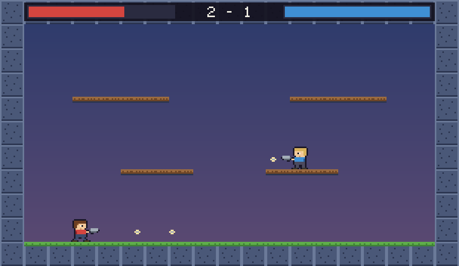

# Pixel Duel

A local two-player pixel-art shooter for Unity. Both players share one keyboard.
There are no art assets to import and nothing to wire up in the editor — every
sprite is drawn from character grids in code, and the game builds its own scene
on Play.



## Getting it running

Unity Hub has been upgraded to 3.21.0 and **Unity 6 LTS (6000.0.82f1, Apple
silicon)** installed for you via the Hub CLI. This folder is a real Unity
project — `ProjectSettings/ProjectVersion.txt` pins it to that editor, so Hub
will match them up automatically.

The install is verified: 8.7 GB on disk, native arm64, signed by Unity, base
editor only (no Android/iOS/WebGL modules). Running it headlessly against this
project gets all the way through engine startup and stops at exactly one thing:

```
No valid Unity Editor license found. Please activate your license.
[Licensing::Client] Found 0 entitlement groups and 0 free entitlements
```

So one step is left, and it has to be you: **activating a licence.** Open Unity
Hub, sign in with a Unity account, and activate the free **Personal** licence.
That needs your credentials, so it is not something I can or should do on your
behalf.

Once that's done, this compiles the project against the real Unity API — a
stronger check than `tools/check.sh`, which only knows my stub classes:

```
/Applications/Unity/Hub/Editor/6000.0.82f1/Unity.app/Contents/MacOS/Unity \
  -batchmode -quit -nographics -projectPath . -logFile -
```

Then:

1. Unity Hub → **Projects → Add → Add project from disk**
2. Pick this folder: `~/Claude/Projects/PixelDuel`
3. Click it to open (first open takes a minute or two while Unity generates its
   `Library/` cache and compiles the scripts)
4. Press **Play**

There is no scene to open and nothing to drag into an inspector slot.
`Game.Boot()` runs on Play via `[RuntimeInitializeOnLoadMethod]` and builds the
camera, arena, both players, and the HUD into whatever scene is open — including
the empty untitled one Unity starts with.

### Is it "built"?

Not in the sense of a compiled artifact, and it doesn't need to be. The scripts
are C# source; Unity's compiler rebuilds them whenever the project opens or a
file changes, and Play runs the fresh build. Your edit loop is: change a number
→ tab back to Unity → it recompiles in a second → press Play.

Making a standalone `.app` (`File → Build Settings`) is a separate thing, and on
this machine it will fail: Apple silicon standalone builds need IL2CPP, which
needs full Xcode, and you only have Command Line Tools. That's the same wall the
SpacePigeon `.app` build hit. It has no bearing on playing in the editor.

## Controls

|         | Move    | Aim   | Jump     | Fire    |
|---------|---------|-------|----------|---------|
| **P1**  | `A` `D` | `W` `S` | `L-Shift` | `Space` |
| **P2**  | `←` `→` | `↑` `↓` | `/`      | `R-Shift` |

`R` returns to the title screen, `Esc` quits.

Jump is a separate key rather than "up" so that up and down are free for aiming
— hold up to fire upward, or hold down in mid-air to fire down. Holding down on
a wooden ledge and pressing jump drops you through it. Releasing jump early
gives a shorter hop.

First to 5 knockdowns wins. Three hits is a knockdown.

## Changing how it feels

The numbers worth touching are all at the top of
[`Player.cs`](Assets/Scripts/Player.cs) — gravity, run speed, jump height,
coyote time, fire rate. The arena is a character grid at the top of
[`Level.cs`](Assets/Scripts/Level.cs): `#` is solid, `=` is a one-way ledge,
`1` and `2` are the spawns. Edit the grid and the camera, collision, and tile
art all follow automatically.

Sprites are character grids in [`Art.cs`](Assets/Scripts/Art.cs), one letter per
pixel, with a key at the top of the file. Both players share one set of grids
and differ only by palette, so recolouring a player is a couple of hex values in
`Art.Palette()`.

## The `tools/` folder

Because the editor loop lives inside Unity, these let the game be checked
without opening it:

| | |
|---|---|
| `./tools/check.sh` | Type-checks every script against stub Unity classes, once per input-handling setting (old Input Manager / new Input System / both), so it compiles whichever way the project is configured. |
| `python3 tools/simulate.py` | Re-implements the physics in Python, reading the constants straight out of `Player.cs`. Checks jump height, that every ledge is reachable from the one below, that a terminal-velocity fall can't clip through the floor at any frame rate, and that one-way ledges work in both directions. |
| `python3 tools/preview.py` | Renders every sprite to `tools/preview.png`, and flags ragged rows or unknown palette letters. |
| `python3 tools/arena.py [play]` | Renders the title screen (or the play view) to PNG using the real map, tiles, font, and HUD layout. |

## What's been verified, and what hasn't

Checked without Unity: every script compiles under all four input
configurations; all sprite grids are rectangular and use known palette letters;
jump apex is 3.38 units against 3-unit tiers; both ledge tiers are reachable
from the one below; a full-speed fall lands on the floor at 60, 45, and 30 fps
rather than tunnelling through it; ledges catch you from above and drop you
through on command.

Not checked, because it needs a human at a keyboard: whether it's fun. Fire
rate, knockback, respawn delay, and how floaty the jump feels are all guesses
that want a real playtest.
